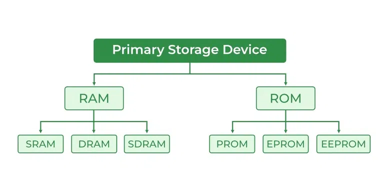

## System calls
- A system call is a mechanism that allows a program running in user mode to switch to kernel mode and request a service from the OS kernel.


| Category                    | Examples                                            | Description                                  |
| --------------------------- | --------------------------------------------------- | -------------------------------------------- |
| **Process Control**         | `fork()`, `exec()`, `exit()`, `wait()`              | Create, terminate, or manage processes       |
| **File Management**         | `open()`, `read()`, `write()`, `close()`, `lseek()` | Manage files and directories                 |
| **Device Management**       | `ioctl()`, `read()`, `write()`                      | Request or release device access             |
| **Information Maintenance** | `getpid()`, `alarm()`, `sleep()`, `gettimeofday()`  | Get or set system data                       |
| **Communication**           | `pipe()`, `shmget()`, `send()`, `recv()`            | Facilitate inter-process communication (IPC) |

- Process
A process is a program in execution.
It is more than just the program code — it includes the current activity, resources, and state required to run the program.

| Component                       | Description                                                   |
| ------------------------------- | ------------------------------------------------------------- |
| **Program code**                | Also called the text segment — the instructions to execute    |
| **Program counter (PC)**        | Keeps track of the next instruction to execute                |
| **CPU registers**               | Temporary storage for calculations and data                   |
| **Stack**                       | Stores function calls, local variables, return addresses      |
| **Heap**                        | Dynamically allocated memory during execution                 |
| **Data segment**                | Global/static variables                                       |
| **Process control block (PCB)** | OS data structure storing PID, state, priority, and resources |

```bash
Parent: bash syCalls.sh
Child: sleep 1 (created → sleeps → exits → replaced by a new one)
```

## How Operating System Boots up?
Booting is the process of starting a computer and loading the operating system into the main memory (RAM) from storage.

⚙️ Steps of OS Booting
1. Power-On & POST (Power-On Self-Test)
- When you press the power button:
    - The power supply turns on the CPU, memory, and peripherals.
    - The BIOS/UEFI firmware runs the POST to check hardware like RAM, CPU, keyboard, etc.
- If a problem is found → error beep codes or messages.

2. BIOS/UEFI Initialization
- BIOS/UEFI is firmware stored on a chip on the motherboard.
- It initializes hardware and sets up a minimal environment.
- Locates the bootable device (HDD, SSD, USB).

3. Bootloader Execution
- BIOS/UEFI loads the bootloader from the boot sector of the boot device.
- Common bootloaders: GRUB (Linux), Windows Boot Manager.
- The bootloader is a small program that loads the OS kernel into memory.

4. Loading the OS Kernel
- The kernel (core part of OS) is loaded into RAM.
- Kernel initializes:
    - Memory management
    - Process scheduler
    - Device drivers
    - File system

5. Initial System Processes
- The kernel starts the first system process:
    - Linux → init or systemd
    - Windows → smss.exe, wininit.exe
- This process starts other system services, background processes, and prepares the system for user interaction.  
```bash
Power ON
   ↓
POST (Power-On Self-Test)
   ↓
BIOS / UEFI Initialization
   ↓
Bootloader Loads OS Kernel
   ↓
Kernel Initialization
   ↓
Start System Processes (init/systemd)
   ↓
Load User Interface (GUI/CLI)
```
## CMOS (Complementary Metal-Oxide-Semiconductor) 
- is a small memory chip on the motherboard that stores system hardware settings, like:
    - Date and time
    - Boot order
    - Hardware configuration (CPU, RAM, drives)
    - Passwords and system options
- It works even when the computer is turned off, thanks to a small CMOS battery.

### ⚙️ Key Points About CMOS
- Stores BIOS/UEFI Settings
    - CMOS holds the configuration settings for the BIOS or UEFI firmware.
- Volatile Memory
    - CMOS memory is volatile, meaning it loses data if the battery dies.
- Powered by CMOS Battery
    - Usually a small coin-cell battery (like CR2032) on the motherboard keeps it alive when the PC is off.
- Adjustable via BIOS/UEFI
    - Users can change settings like boot order, system clock, enabling/disabling devices, etc.


## 🧩 Difference Between 32-bit and 64-bit Operating Systems
- The terms 32-bit and 64-bit refer to how a computer’s CPU (Central Processing Unit) handles information.
- A 64-bit OS can process and store data in 64-bit chunks, while a 32-bit OS can handle only 32-bit chunks at a time.


| Feature                          | **32-bit OS**                         | **64-bit OS**                                                                   |
| -------------------------------- | ------------------------------------- | ------------------------------------------------------------------------------- |
| **Processor Register Size**      | 32 bits                               | 64 bits                                                                         |
| **Max Addressable Memory (RAM)** | Up to **4 GB**                        | More than **4 GB** (Theoretical limit is 16 Exabytes; practical limit ~ 256 TB) |
| **Performance**                  | Slower for modern applications        | Faster and more efficient                                                       |
| **Software Compatibility**       | Can run only **32-bit applications**  | Can run **both 32-bit and 64-bit applications**                                 |
| **Data Handling**                | Processes 4 bytes (32 bits) at a time | Processes 8 bytes (64 bits) at a time                                           |
| **Security Features**            | Limited                               | Enhanced (e.g., Kernel Patch Protection, DEP, ASLR)                             |
| **OS Example**                   | Windows 7 32-bit, Ubuntu 16.04 32-bit | Windows 10/11 64-bit, Ubuntu 22.04 64-bit                                       |
| **CPU Requirement**              | Works on 32-bit and 64-bit CPUs       | Works **only** on 64-bit CPUs                                                   |


## 🧩 Comparison Between Different Types of Storage Devices in a Computer

| Type                            | Description                                         | Example                   |
| ------------------------------- | --------------------------------------------------- | ------------------------- |
| **Primary Storage**             | Directly accessible by the CPU, very fast, volatile | RAM, Cache                |
| **Secondary Storage**           | Non-volatile, used for long-term data storage       | Hard Disk, SSD            |
| **Tertiary / External Storage** | Used for backups or portable data transfer          | Optical Discs, USB, Cloud |
