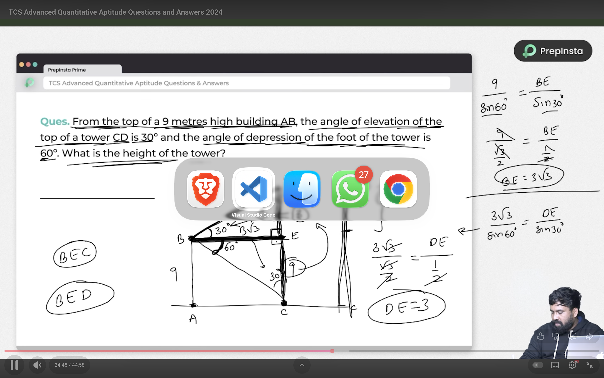
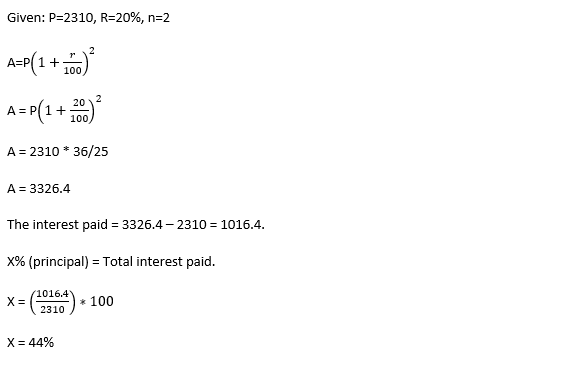
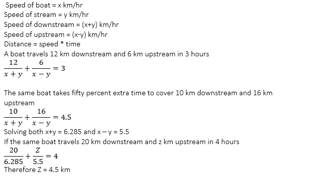

## Formula for Quantity of Remaining WineThe quantity of pure substance left after $n$ operations of replacing a part of the mixture is given by the formula:

qn = q0*(1-r/q)^n;

## 9 digit nums by 1,2,3,4,5

=> 5 * 5^7 = 5^8 .

## Elevation and depression

## Q3) If n is an integer such that 1nn352 is a six-digit number exactly divisible by 24, What will be the sum of the possible values of n?

11+2n = 3x => n = 2,2 ; 5 , 5 ; 8 , 8 ;

## Q4) What is mean proportional (MP) between the MPs of (2/7 & 32/343) and (2 & 1/5000)?
- x = √(2/7)*(32/343)
- y = √(2)*(1/5000) = √1/2500 = 1/50
- MP of x and y = √(8/49)*(1/50) = √8/2450

## Q7) Rahl takes a sum of Rs. 2310 as a loan. He has to repay this in two equal annual installments. If the rate of interest is 20% compounded annually, what percent of the principal amount taken by  Rahul is the total interest paid by him.

## Q12) A boat travels 12 km downstream and 6 km upstream in 3 hours. The same boat takes fifty percent extra time to cover 10 km  downstream and 16 km upstream. If the same boat travels 20 km downstream and z km upstream in 4 hours find z.

## A sum of Rs 7500 amounts to Rs 9075 at 10% p.a in a certain time, when the interest is compounding annually. What is the amount in (Rs) of the sum at the same sum at the same rate for 6/5th of the earlier time.

## An office has two clocks. One clock is in the conference room and the other clock is in the cafeteria. The clock in the conference room gains 10 minutes every hour while the clock in the cafeteria gets slower by 10 minutes every hour. When will both clocks show the same time again?

12 * 60 (12 hours ) / 20 (20 min difference )