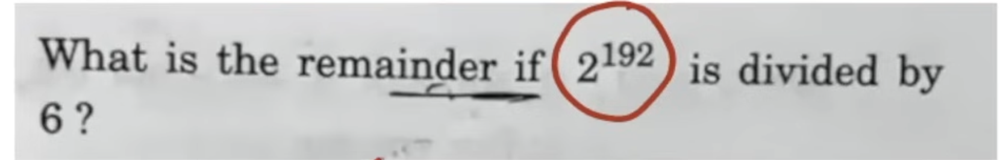

| Topic             | Formula                                                                                   |
| ----------------- | ----------------------------------------------------------------------------------------- |
| LCM & HCF         | ( a×b = LCM×HCF )                                                                         |
| Algebra           | ( a^3 - b^3 = (a - b)(a^2 + ab + b^2) )                                                   |

## 

- /6 , not /3 then diffrent reminder .

