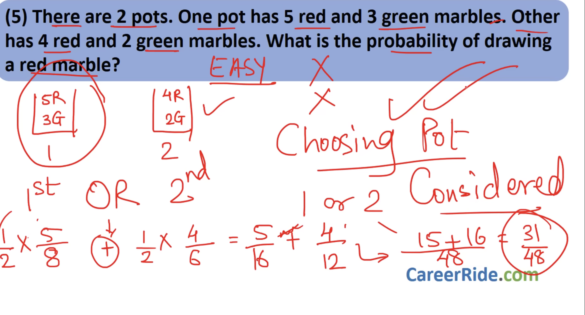
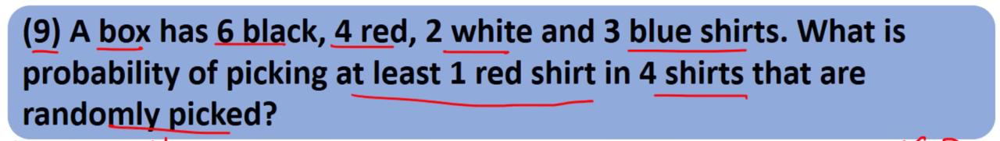

## 
- p = favour / total .

- p + p' = 1 ;

- 1/2 prob of choosing either pot or divide ans by 2.

## 

1-(11/15 * 10/14 * 9/13 * 8/12)
= 69/91 . 
-   

## 
- Deck / Pack — the full set of 52 playing cards.

Card — an individual playing card.

Suit — one of the four categories: Hearts, Diamonds, Clubs, Spades.

Rank — the value of a card: A, 2–10, J (Jack), Q (Queen), K (King).

Face card — J, Q, K (have faces).

Pip card — numbered cards 2–10 showing pips (symbols).

Ace — can be high or low depending on game rules.

Color — red (Hearts, Diamonds) or black (Clubs, Spades

