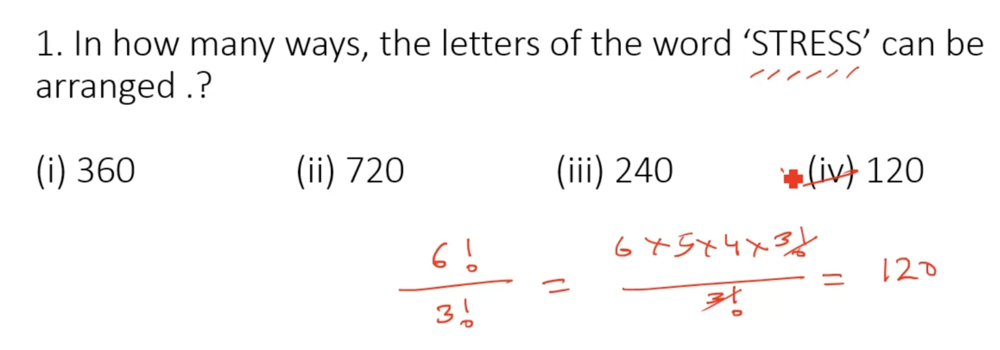
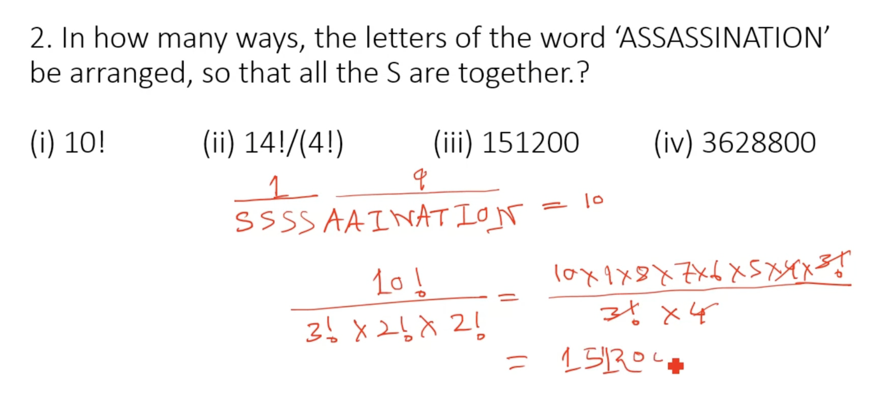

## P N C
- nPc = n!/(n-r)!
- nC r = n!/(r!)(n-r)!

- repeatting letters are divide .

- vovewls together means 
2! . 5c3 
2! for vovels combos .

##  Out of 7 consonants and 4 vowels, how many words of 3 consonants and 2 vowels can be formed? 

- 210×120=25200.

