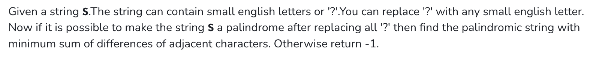

## 

class Solution {
public:
    int minimumSumPalindrome(string s) {
        int n = s.size();
        int l = 0, r = n - 1;
        
        while (l < r) {
            if (s[l] == '?' && s[r] == '?') {
                s[l] = s[r] = 'a';
            } else if (s[l] == '?') {
                s[l] = s[r];
            } else if (s[r] == '?') {
                s[r] = s[l];
            } else if (s[l] != s[r]) {
                return -1;
            }
            l++; r--;
        }
        if (n % 2 == 1 && s[n/2] == '?') s[n/2] = 'a'; // middle char

        int ans = 0;
        for (int i = 1; i < n; i++) {
            ans += abs(s[i] - s[i - 1]);
        }
        return ans;
    }
};
